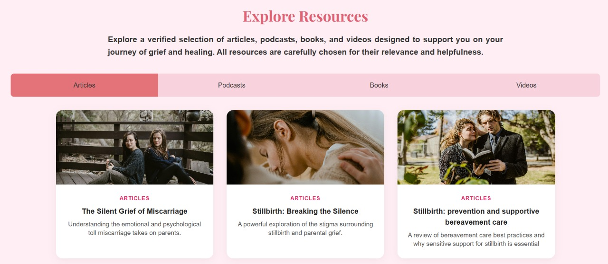
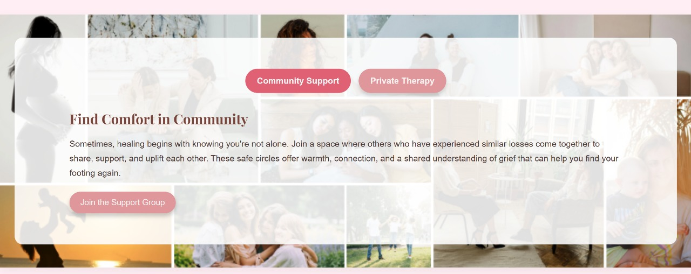
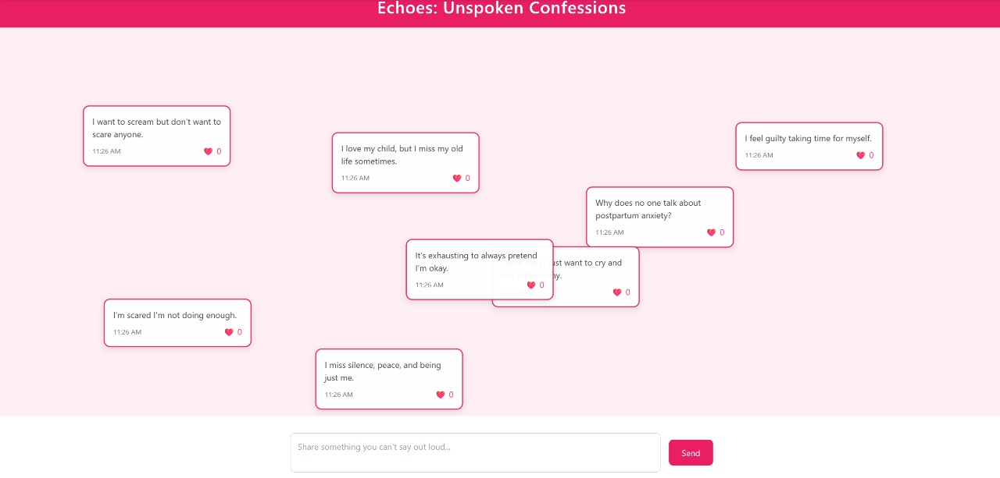
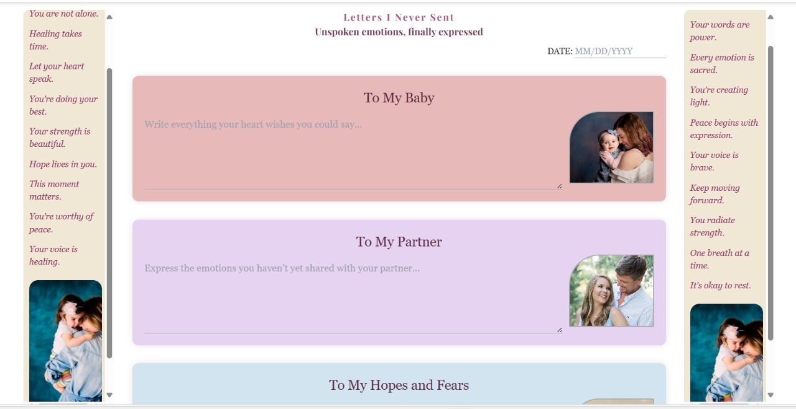
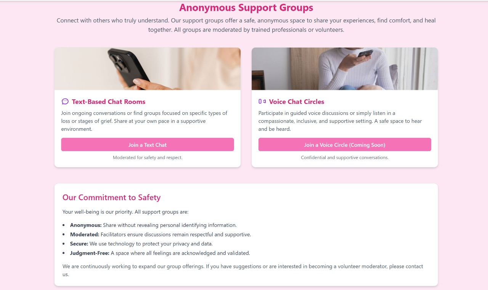
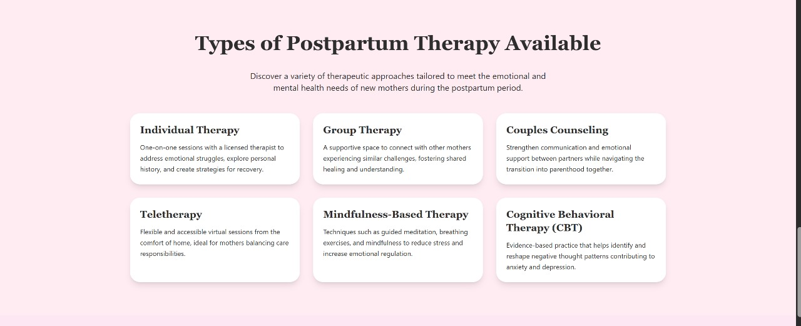

#  Embrace – Mental Wellness Platform for Women

**Embrace** is a safe, supportive, and judgment-free platform built to support women through the emotional challenges of postpartum depression, hormonal disorders (like PCOS/PCOD), pregnancy loss, anxiety, and more. It provides a blend of emotional outlets, education, and community—giving women a space to feel seen, heard, and healed.


##  Problem Statement

Many women silently struggle with postpartum depression, anxiety, pregnancy loss, or hormonal imbalances—yet there's a lack of platforms that validate these emotions and offer personalized emotional support. *Embrace* aims to fill that gap by offering an empathetic digital space tailored to the emotional and mental health needs of women.


##  Key Features

### Themed Healing Rooms
- **Loss Room** – For miscarriage and stillbirth support.  
- **Hormonal Room** – For PCOS, anxiety, and hormonal struggles.  
- **New Mom Room** – For postpartum emotions, body image issues, and relationship changes.  




Each room includes:
- Real-life stories
- Curated videos, articles, podcasts, and books
- Community support & therapist recommendations
- Letter-writing option for emotional expression

###  Echoes (Confession Page)
An anonymous space where women can write and read unfiltered, emotional confessions—helping them feel less alone.



###  Unsent Letters
A deeply personal journaling tool to write letters to:
- Their baby  
- A partner  
- Their body  
- Their hopes and fears  
- Or even to themselves  


###  Connect
- **One-on-One Healing** – Therapist discovery & recommendation.
- **Community Support** – Text & voice-based anonymous support circles.





###  What We Treat
Education and awareness page covering:
- Postpartum depression/anxiety
- Causes, symptoms, therapy types
- Mental health myths and guidance

---

## ✅ Uses of Embrace

- 🔄 **Emotional Processing** – Write, release, and reflect through letters and confessions.
- 🫂 **Peer Support** – Feel connected with women going through similar experiences.
- 📖 **Self-Education** – Learn about mental health conditions like postpartum depression and PCOS.
- 🧑‍⚕️ **Professional Help** – Easily find and get matched with mental health professionals.
- 🧘 **Healing Tools** – Use real-life stories and journaling to find hope and closure.

---

## 💡 Inspiration

The inspiration behind *Embrace* came from the realization that there are very few safe spaces online that truly support women emotionally—especially during the most silent and painful chapters of their lives. Postpartum breakdowns, miscarriages, PCOS struggles, and silent resentment in motherhood are often brushed aside. We wanted to give those emotions a home—where healing begins not with advice, but with validation.

---

## 👥 Team

- **Riddhi**   
- **Vaishnavi**
- **Sanvi**
- **Ruzal**
---

## 🛠️ Tech Stack

| Layer       | Technology |
|-------------|------------|
| Frontend    | HTML, CSS, JavaScript |
| Backend     | Node.js, Express.js |
| Database    | MongoDB |
| Real-Time   | Socket.IO (for chat features) |
| Auth/Hosting| Firebase (optional) |

---

## 🧪 How to Run Locally (Optional)

> *For future deployment or development use.*

1. Clone this repository  
   ```bash
   git clone https://github.com/your-username/embrace.git
   cd embrace
